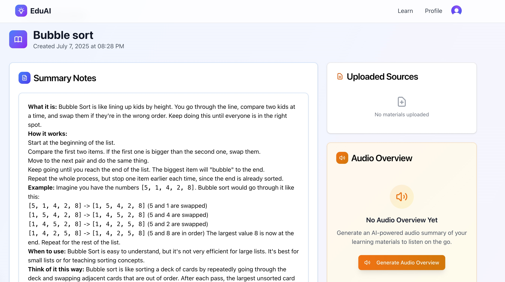
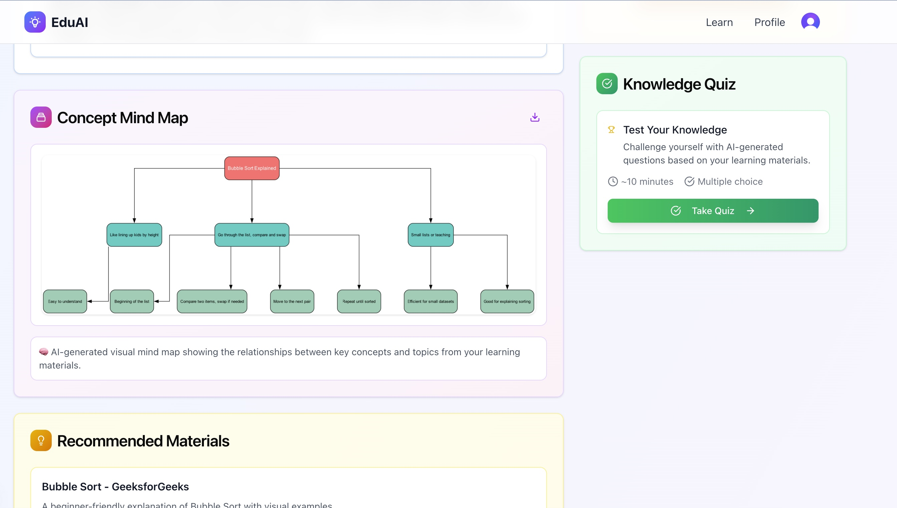
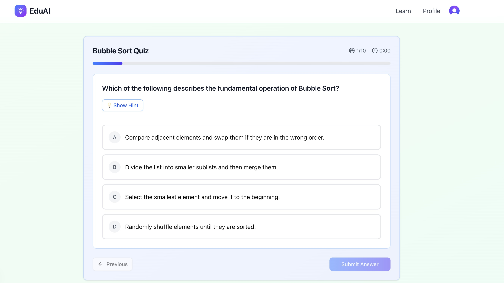

# Educational AI Web Application

An AI-powered educational platform that provides personalized learning experiences through various interactive features including summaries, quizzes, mind maps, recommendations, and audio overviews.

## Screenshots







## Project Structure

```
/
├── backend/          # FastAPI backend with AI agent workflow
├── frontend/         # Next.js frontend application
└── training/         # Jupyter notebooks used for development and training the agentic workflow
```

## Features

- **AI-Powered Content Processing**: Intelligent content analysis and processing using LangGraph workflows
- **Interactive Quizzes**: Generate quizzes based on educational content
- **Mind Maps**: Create visual mind maps for better understanding
- **Audio Summaries**: Generate audio overviews of educational content (Text to Speech)
- **Personalized Recommendations**: AI-driven content recommendations

## Tech Stack

### Backend

- **FastAPI** - Modern Python web framework
- **LangGraph** - Agent workflow orchestration
- **LangChain** - LLM framework
- **Supabase** - Database and storage
- **Boto3** - AWS services integration
- **AWS Polly** - Text to Speech Conversion

### Frontend

- **Next.js 15** - React framework
- **TypeScript** - Type-safe JavaScript
- **Tailwind CSS** - Utility-first CSS framework
- **Clerk** - Authentication and user management
- **Supabase** - Database and storage

### Development

- **Python 3.12+** - Backend runtime
- **Node.js** - Frontend runtime
- **UV** - Python package manager
- **Jupyter Notebooks** - Development and experimentation

## Getting Started

### Prerequisites

- Python 3.12+
- Node.js 18+
- UV package manager

### Backend Setup

1. Navigate to the backend directory:

   ```bash
   cd backend
   ```

2. Install dependencies:

   ```bash
   uv sync
   ```

3. Set up environment variables (create `.env` file with required keys)

4. Start the backend server:
   ```bash
   uv run src/main.py
   ```

The backend API will be available at `http://localhost:7007`

### Frontend Setup

1. Navigate to the frontend directory:

   ```bash
   cd frontend
   ```

2. Install dependencies:

   ```bash
   npm install
   ```

3. Start the development server:
   ```bash
   npm run dev
   ```

The frontend will be available at `http://localhost:3000`

## AI Agent Workflow

The backend implements a sophisticated AI agent workflow using LangGraph that includes:

- **Summary Generation** - Creates comprehensive summaries of educational content, supports multimodal input (Text and PDF)
- **Quiz Generation** - Generates interactive quizzes based on content
- **Mind Map Creation** - Produces visual mind maps for better comprehension
- **Recommendation Engine** - Provides personalized learning recommendations
- **Audio Overview** - Creates audio summaries and overviews

## Development

### Training Environment

The `training/` directory contains Jupyter notebooks for:

- Multi-modal AI experiments
- Output parsing development
- Parallel LLM graph processing
- Podcast generation
- Quiz generation training
- Recommendation system development
- Speech synthesis experiments
- Summary generation training
- Supabase integration testing

### API Endpoints

- `GET /` - Health check
- `POST /api/workflows/*` - AI workflow endpoints

## License

This project is licensed under the MIT License.
